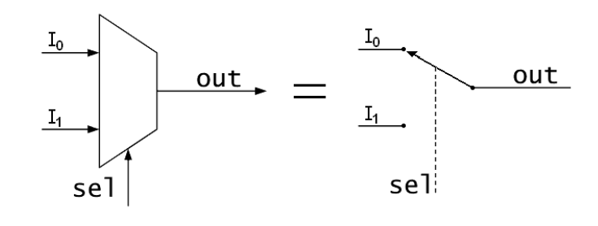
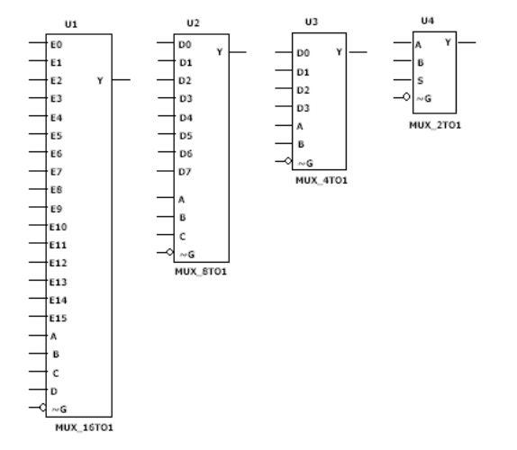
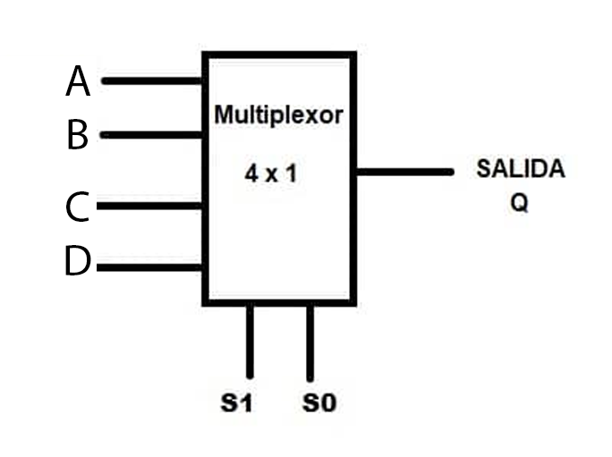

<!-- _backgroundColor: Orange -->
<!-- _color: white-->

# Presentador: Victor Miguel Barrera Peña
## Tema: 10 Multiplexor

---

# Teoría

Hay que recordar como es electrónicamente, existe.

---

# Esquema funcionamiento




Del lado izquierdo vemos como se ve en VHDL, del lado derecho vemos como físicamente se movería.

---

# Diferentes tamaños

Si vieramos diferentes tamaños de multiplexor, podría ser como las siguientes :




---

# ¿Qué es lo que hace?

Cambia entre los difernetes canales de entrada de acuerdo a los bits asignados del selector.


|  $s_1$ | $s_2$  | e (hex)  | Salida (Hex)  | 
|---|---|---|---|
| 0  | 0  |  A |  A | 
|  0 |  1 |  B |  B |
| 1  | 0  |  C |  C | 
|  1 | 1  |  D |  D |



---

# Veamos el código

```vhdl
library ieee;
use ieee.std_logic_1164.all;
```

```vhdl
entity p10 is 
	port(
		entrada : in std_logic_vector(3 downto 0);
		selector : in std_logic_vector (1 downto 0);
		salida: out std_logic
	);
end entity p10;
```
---

```vhdl
architecture behavior of p10 is begin
	
	with selector select
		salida <= entrada(0) when "00",
					entrada(1) when "01",
					entrada(2) when "10",
					entrada(3) when others;

end architecture behavior;
```

---

# Veamos su comportamiento

---

# Muchas gracias por ver el video


