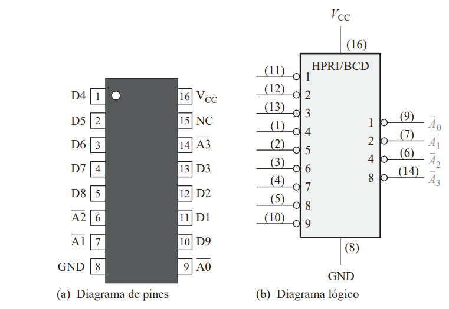
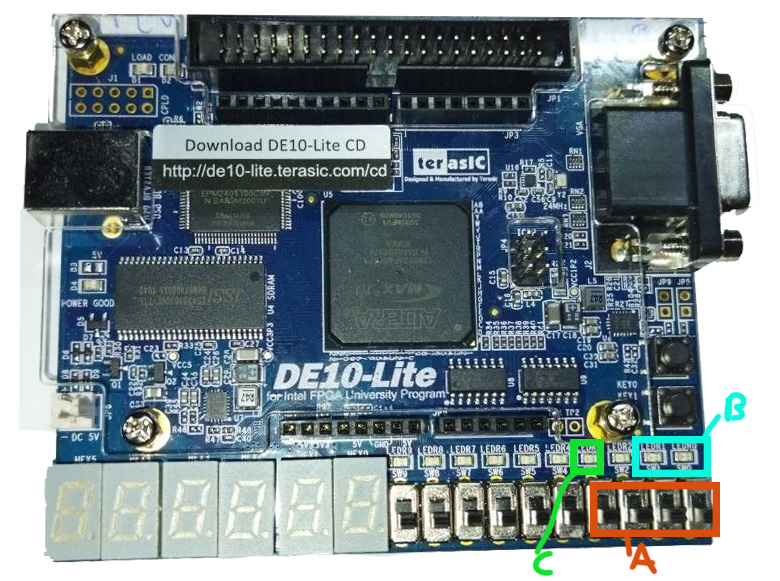

<!-- _backgroundColor: Orange -->
<!-- _color: white-->

# Presentador: Victor Miguel Barrera Peña
## Tema: 11 Codificador de prioridad, señal de grupo. 

---

# Teoría

Hay que recordar como es electrónicamente, existe.

---

# Diagrama lógico y de pines


 Obtenido del libro Floyd.

---

# Esquema funcionamiento


Hay que recordar que es un códificador electrónicamente.

---

# Diferentes tamaños

Para definir el tamaño del decodificador tenemos que preguntar lo siguiente:
-  ¿Cuantos elementos diferentes puedo codificar. Por ejemplo del **0-9** son 10 elementos de **entrada**.
   -  El número encontrado va a ser el número **N** se le apica la siguiente operación  $log_2(N)=M$.
- **M** es el número de  bits de **salida**.
- Un bit que indica si algún switch esta encendido.

---

# ¿Qué es lo que hace?

- Códifica de un sistema decimal a un sistema binario, no es completo, debido a que sólo codifica los del 0 al 3 en binario. Además se incluye un led para saber si hay algun switch encendido
- La entrada es mediante `switch`.
- Las salidas es mediante dos `leds`.


---

# Veamos el código

```vhdl
library ieee;
use ieee.std_logic_1164.all;
```

```vhdl
entity p11 is
	port (
		selector: in std_logic_vector(3 downto 0);
		salida : out std_logic_vector( 1 downto 0);
		comprobador: out std_logic 
	);

end entity p11;
```
---

```vhdl
architecture behavior of p11 is begin
	
	salida <= "11" when selector(3) ='1' else
				 "10" when selector(2) ='1' else
				 "01" when selector(1) ='1' else
				 "00";
				 
	comprobador <= selector(3) or selector(2) or selector(1) or selector(0);

end architecture behavior;
```

---


# Asignación


- **A** Son los pines de la entrada.
- **B** Son los pines de salida.
- **C** Es el pin de salida del comprobador.


---

# Veamos su comportamiento

---

# Muchas gracias por ver el video


