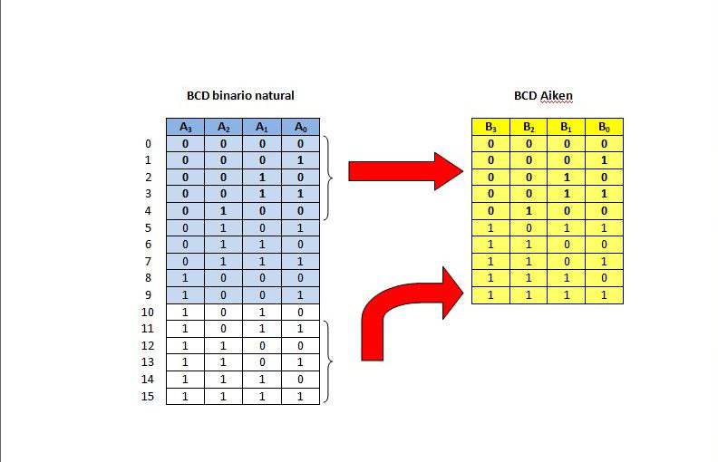
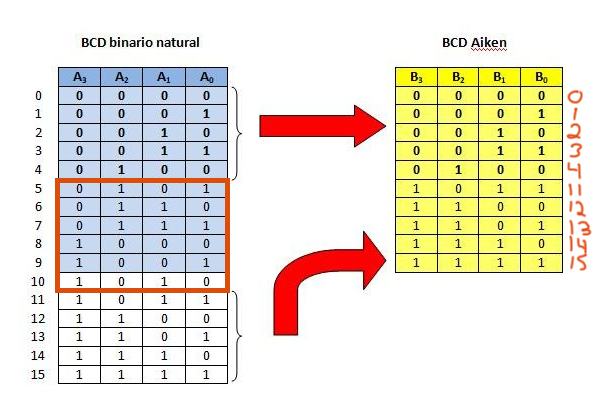
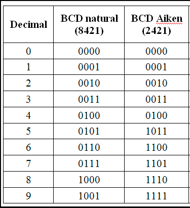
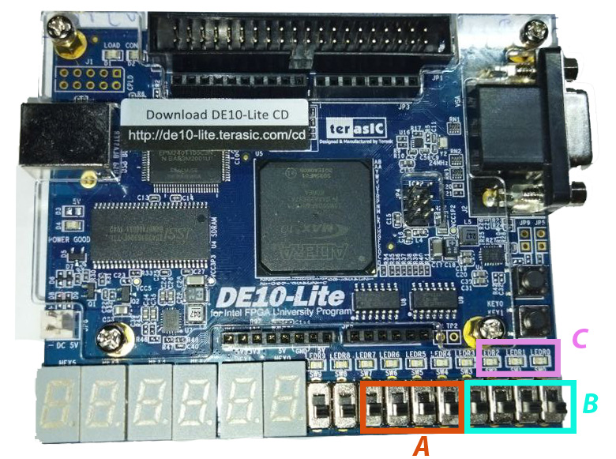

<!-- _backgroundColor: Orange -->
<!-- _color: white-->

# Presentador: Victor Miguel Barrera Peña
## Tema: 12 Conversor de BCD Natural a Aiken

---

# Teoría

Hay que recordar como es electrónicamente, existe.

---

Hay que recordar la códificación Aiken, y para ello veremos la tabla que muestre la codificación.

Vamos a verlo a detalle en la siguiente imagen:
- El cuadro rojo se ignora
- En BCD aiken los números en rojos son el número de BCD natural que le corresponde.




---



---

Veamos una tabla para transcodificar.



---


# Funcionamiento

Recuerda la idea de como funciona un decodificador, es lo mismo , pero en este caso no sólo códifica y listo, sino que la entrada ya esta codificada y sólo necesita transformarse en otra codificación

---

# Veamos el código

```vhdl
library ieee;
use ieee.std_logic_1164.all;
use ieee.numeric_std.all; --nuevos tipos de datos usigned

```

```vhdl
entity p12 is
	port(
		n_i : in std_logic_vector(3 downto 0);
		a_o : out std_logic_vector(3 downto 0);
		error : out std_logic
		);
end entity p12;
```
---

```vhdl
architecture behavior of p12 is begin

	a_o <= n_i when unsigned(n_i) < 5  else
		"0000"  when  9 <  unsigned(n_i) 
		else std_logic_vector(unsigned(n_i) + 6);
		
	-- saber error
	error <= '1'  when  9 <  unsigned(n_i)
			else '0';

end architecture behavior;
```

---


# Asignación


- **A** Son los led de salida.
- **B** Son los switch de entrada.
- **C** Error codificiación


---

# Veamos su comportamiento

---

# Muchas gracias por ver el video


