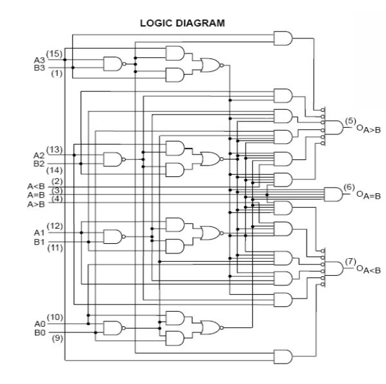
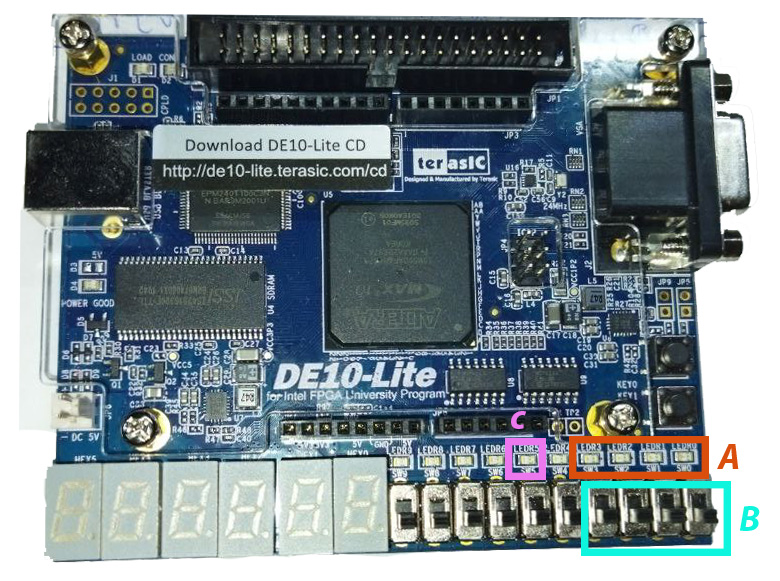
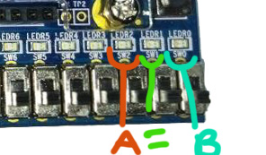

<!-- _backgroundColor: Orange -->
<!-- _color: white-->

# Presentador: Victor Miguel Barrera Peña
## Tema: 13 comparador genérico de enteros. 

---

# Teoría

Hay que recordar como es electrónicamente, existe.

---


# Funcionamiento

- La comparación lógica de 4 bits, los 4 significan a el tamaño de cada entrada.
- Tiene 1 salida con 3 salida, una en que $A$ es mayor, otra en que $B$ es mayor y otra en que $A=B$.


---

# Más tamaños

- 1 bit
- 2 bits
- 4 bits (SN74LS85)
- 8 bits
- 16 bits
- 24 bits
- 32 bits

---

# Diagrama lógico


- Es de 4 bits.


---

# Veamos el código

```vhdl
library ieee;
use ieee.std_logic_1164.all;
use ieee.numeric_std.all;

```

```vhdl
entity p13 is
	generic (N : positive :=4);
	port(
			a : in std_logic_vector(N-1 downto 0);
			b : in std_logic_vector(N-1 downto 0);
			mayor,menor,igual : out std_logic
	);

end entity p13;
```
---

```vhdl
architecture behavior of p13 is begin
	mayor <= '1' when signed(a) > signed(b) else '0';
	menor <='1' when signed(a) < signed(b) else '0';
	igual <='1' when signed(a) = signed(b) else '0';

end architecture behavior;
```

---


# Asignación


- **A** Entrada A.
- **B** Entrada B.
- **C** Salida comparador.


---
Ahora veamos como van a ser las salida:
- El primer led se enciende cuando **A** es mayor.
- El segundo si son iguales.
- El tercero si **B** es mayor




---

# Veamos su comportamiento

---

# Muchas gracias por ver el video


