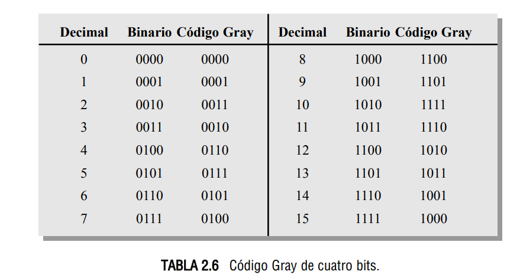
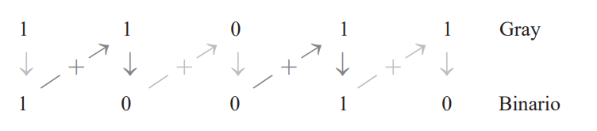
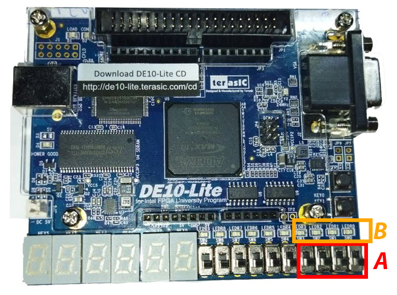

<!-- _backgroundColor: Orange -->
<!-- _color: white-->

# Presentador: Victor Miguel Barrera Peña
## Tema: 14 Conversor genérico Gray a Natural binario.

---

# Teoría

Hay que recordar como es electrónicamente, existe.

---


# Funcionamiento

- Introuducimos un número en gray o reflejado y este se convertirá en en binario.
- A cada bit de salida se le aplica una operación de salida, ya sea `xor` o asignación directa.


---

# Más tamaños

Puedes implementarlo del tamaño que desees, mientras tengas el mismo tamaño de entrada que de salida disponible, en nuestro caso la **entrada** es de 4 bits y por tanto la salida también es de 4 bits.

---

# Tabla de conversión



---

# Instrucciones para convertir

1. El bit más significativo (bit más a la izquierda) en el código binario es el mismo que el correspondiente bit en código Gray.
2. A cada bit del código binario generado se le suma el bit en código Gray de la siguiente posición adyacente. Los acarreos se descartan.

---

# Ejemplo

El siguiente problema viene del libro Floy, pág 97



---

# Ejemplo manual

Vamos a comprobar que $0100_{gray} \Rightarrow  0111_{bin}$ (7 en decimal).


---


# Veamos el código

```vhdl
library ieee;
use ieee.std_logic_1164.all;

```

```vhdl
entity p14 is
	generic (N : integer:= 4);
	port(
		entrada: in std_logic_vector(N-1 downto 0);
		salida: out std_logic_vector(N-1 downto 0)
	);
end entity p14;
```
---

```vhdl
architecture behavior of p14 is
	signal baux : std_logic_vector(N-1 downto 0);
begin
	baux(N-1) <= entrada (N-1);
	baux(N-2 downto 0) <= baux(N-1 downto 1) xor entrada(N-2 downto 0);
	
	salida<= baux;
end architecture behavior
```

---

# Ejemplo con el código

Vamos a comprobar que $0100_{gray} \Rightarrow  0111_{bin}$ (7 en decimal).

---


# Asignación


- **A** Entrada A.
- **B** Salida B.




---

# Veamos su comportamiento

---


# Referencias (informales)

- **Video profesora Susana** https://www.youtube.com/watch?v=mvz8jaOafWw&t=341s
- **Video aprender a convertir gray** https://www.youtube.com/watch?v=eVmdtSdXeDs&t=53s
- **FLOYD, T. L. (2006).** FUNDAMENTOS DE SISTEMAS DIGITALES (9a. ed.). MADRID: PEARSON EDUCACION. [Pág 97]

---

# Muchas gracias por ver el video


