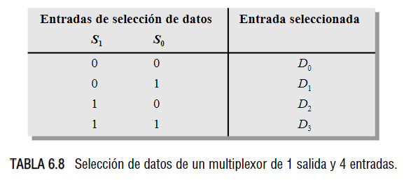
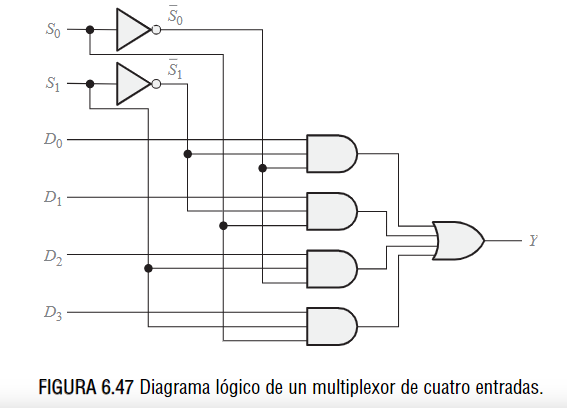
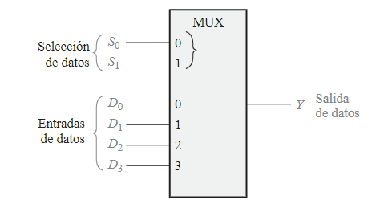
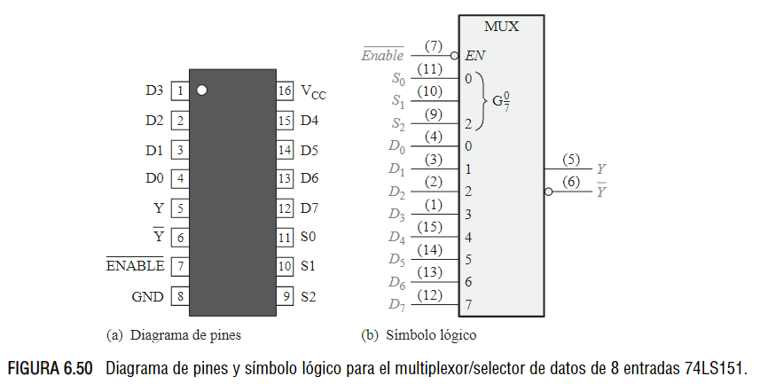
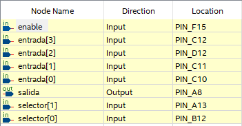
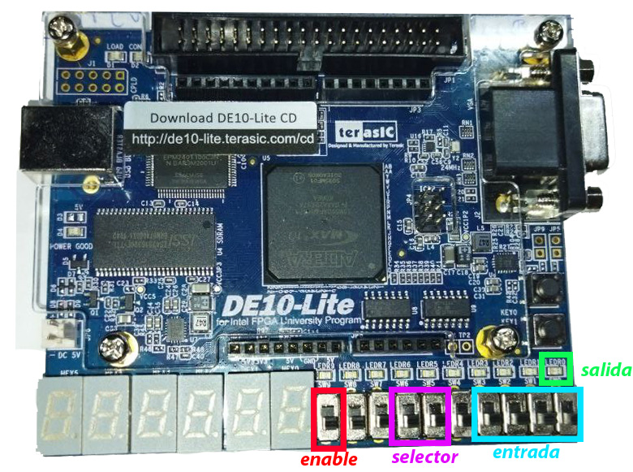

<!-- _backgroundColor: Orange -->
<!-- _color: white-->

# Presentador: Victor Miguel Barrera Peña
## Tema: 15 Descripción: multiplexor genérico. 

---

# Teoría

Hay que recordar como es electrónicamente, existe.

- El objetivo de este circuito es tener múltiples entradas y una salida seleccionada de las entradas.


---


# Funcionamiento
- Internamente se encuentra implentado con compuertas lógicas AND,OR, Negaciones.




---




la salida queda :

$$
Y=D_0 \bar{S}_1 \bar{S}_0+D_1 \bar{S}_1 S_0+D_2 S_1 \bar{S}_0+D_3 S_1 S_0
$$


---

# Símbolo lógico

 

- Tiene 2 bits de selección.
- 4 entradas.
- Una salida.

---

# Diagramas

El ejemplo para el 74LS151, este tiene 8 entradas, 3 bits de selección, puerto enable, tiene tanto la salida como su complemento.



---

# Veamos el código

```vhdl
library ieee;
use ieee.std_logic_1164.all;
use ieee.numeric_std.all; --nuevos tipos de datos usigned

```

```vhdl
--Muxn ==p15
entity p15 is
	generic (N : positive :=2);
	port(
		entrada : in std_logic_vector(2**N-1 downto 0); --i
		selector : in std_logic_vector(N-1 downto 0); --s
		enable : in std_logic; --e
		salida : out std_logic --y 
		);
end entity p15;
```
---

```vhdl
architecture  behavior of  p15 is
begin
	salida <= entrada (to_integer(unsigned(selector))) and enable;

end  behavior;
```

---

# Asignación de pines

- De10-lite



---





---


# Veamos su comportamiento

---

# Referencias

- *FLOYD, T. L. (2006).* FUNDAMENTOS DE SISTEMAS DIGITALES (9a. ed.). MADRID: PEARSON EDUCACION. [Pág 367-372]
- *Video profesora Susana*  https://www.youtube.com/watch?v=DtakxchcRAM&t=6s

---

# Muchas gracias por ver el video


