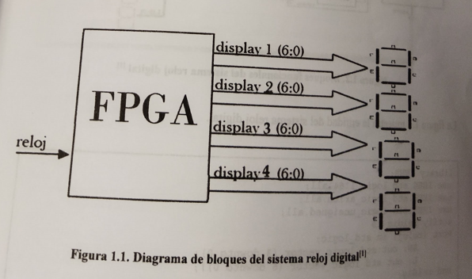
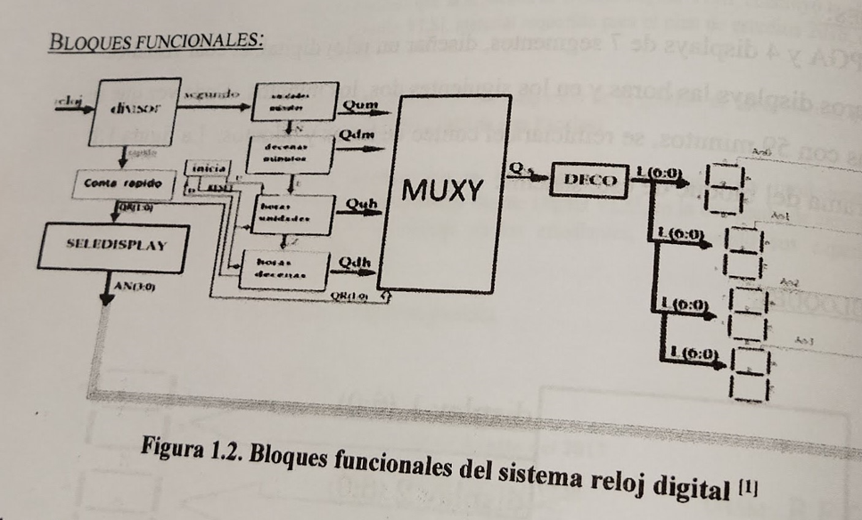

# Práctica 1 Diseño de un reloj digital

## Objetivo

Demostrar a los estudiantes que un FPGA las declaraciones concurrentes se  efectúan al mismo tiempo (en paralelo). Implantar operaciones concurrentes mediante el diseño de un reloj digital, en  donde el orden de escritura en las instrucciones concurrentes no afecta el resultado de síntesis o de simulación.

## Especificaciones

Utilizando un FPGA y 4 displays de 7 segmentos, diseñar un reloj digital, el cual visualice en los dos primeros displays las horas y en los siguientes dos, los minutos. La figura 1.1 muestra  el diagrama del bloque de un sistema.



Un FPGA puede configurarse con muchos bloques funcionales en lenguaje VHDL, que estén ejecutando acciones a la vez. A estas acciones ejecutándose acciones a la vez. A estas acciones a la vez. A estas acciones ejecutándose al mismo tiempo se le llama ejecución concurrente.

Las señales son declaraciones necesarias cuando se ejecutan las instrucciones concurrentes, debido a que ellas unen los bloques funcionales.

La figura 1.2 muestra los bloques funcionales del sistema reloj digital donde las señales se muestran con fleca de color azul.



La figura 1.3 muestra la entidad del sistema del reloj digital.

```vhdl
library IEEE;
use IEEE.std_logic_1164.all;
use IEEE.std_logic_arith.all;
use IEEE.std_logic_unsigned.all;
entity reldig is
    Port(
        reloj : in std_logic;
        AN: out std_logic_vector (3 downto 0);
        L: out std_logic_vector (6 downto 0)
    );
end reldig;
```


```vhdl

architecture behavioral of reldig is
	signal segundo: std_logic;
	signal rapido: std_logic;
	signal n: std_logic;
	signal Qs: std_logic_vector (3 downto 0);
	signal Qum: std_logic_vector (3 downto 0);
	signal Qdm: std_logic_vector(3 downto 0);
	signal e: std_logic;
	signal Qr: std_logic_vector(1 downto 0);
	signal Quh: std_logic_vector(3 downto 0);
	signal Qdh: std_logic_vector(3 downto 0);
	signal z: std_logic;
	signal u: std_logic;
	signal d: std_logic;
	signal reset: std_logic;
```


```vhdl
begin
    divisor: process(reloj)
        variable cuenta: std_logic_vector(27 downto 0):= X"0000000";
	begin
		if rising_edge (reloj) then
			if cuenta= X"48009E0" then
				cuenta:= X"0000000";
			else
				cuenta:= cuenta +1;
			end if;
		end if;
		segundo <= cuenta(22);
		rapido <= cuenta(10);
	end process;
	
	unidades process (segundo)
		variable cuenta: std_logic_vector(3 downto 0):= "0000";
	begin
		if rising_edge (segundo) then
			if cuenta = "1001" then
				cuenta:="0000";
				N<='1';
			else
				cuenta:= cuenta +1;
				n<= '0';
			end if;
		end if;
		qum<= cuenta;
	end process;
```

Figura 1.5 (continuación) Parte operatoria de la arquitectura del sistema reloj digital.

```vhdl
decenas : process (n)
	variable cuenta: std_logic_vector(3 downto 0):="0000";
	begin
		if rising_edge (n) then
			if cuenta = "0101" then
				cuenta := "0000";
				e <= '1';
			else
				cuenta:= cuenta +1;
				e<= '0';
			end if;
		end if;
		Qdm<= cuenta;
	end process;
	
HoraU: process (E,reset)
	variable cuenta: std_logic_vector(3 downto 0):="0000";
	begin
		if rising_edge(E) then
			if cuenta= "1001" then
				cuenta:="0000";
				z<='1';
			else
				cuenta:= cuenta +1;
				z<='0';
			end if;
		end if;
		if reset='1' then
			cuenta:="0000";
		end if;
		Quh<=cuenta;
		U<=cuenta(2);
	end process;
	
HoraD: Process(Z,reset)
	variable cuenta: std_logic_vector(3 downto 0):="0000";
	begin
		if rising_edge(Z) then
			if cuenta="0010" then
				cuenta:="0000";
			else
				cuenta:=cuenta+1;
			end if;
		end if;
		if reset='1' then
			cuenta:="0000";
		end if;
		Qdh<= cuenta;
		D<=cuenta(1);
	end process;
```


Figura 1.5 (continuación) Parte operatoria de la arquitectura del sistema reloj digital

```vhdl
inicia: process (U,D)
    begin
		reset<=(U and D);
	end process;
	
Contrapid: process (rapido)
	variable cuenta: std_logic_vector(1 downto 0):= "00";
	begin
		if rising_edge (rapido) then
			cuenta:= cuenta +1;
		end if;
		Qr<= cuenta;
	end process;
	
muxy: process (Qr)
begin
	if Qr= "00" then
		Qs<= Qum;
	elsif Qr= "01" then
		Qs <= Qdm;
	elsif Qr="10" then
		Qs<= Quh;
	elsif Qr= "11" then
		Qs<= Qdh;
	end if;
end process;

seledisplay: process (Qr)
begin
	case Qr is
		when "00" =>
			AN<= "1110";
		when "01" =>
			AN<= "1101";
		when "10" =>
			AN<= "1011";
		when others =>
			AN<= "0111";
	end case;
end process;

with Qs select
	L<= "1000000" when "0000", --0
	L<= "1111001" when "0001", --1
	L<= "0100100" when "0010", --2
	L<= "0011000" when "0011", --3
	L<= "0011001" when "0100", --4
	L<= "0010010" when "0101", --5
	L<= "0000010" when "0110", --6
	
```

## Actividades complementarias

1. El alumno diseñara un reloj digital con alarma , en el cual se active una señal sonora cuya intensidad vaya aumentado que que el usuario apague el sistema.
2. El alumno diseñara un reloj digital que trabaje en sentido contrario a las manecillas del reloj, lo que significa que va a descontar tiempo empezando en un valor prestablecido por el usuario.

