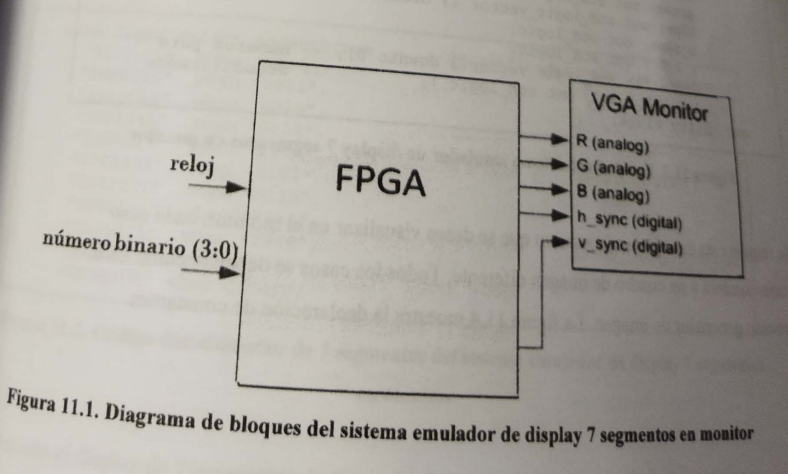
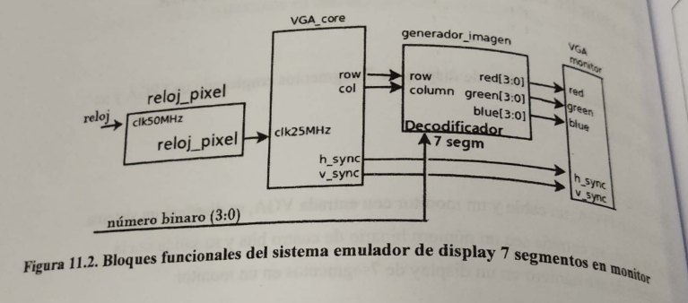
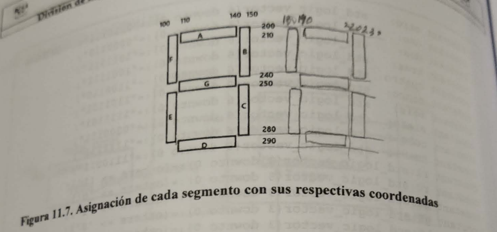

```
Práctica 11. Emulador de display 7 segmentos en monitor
```

## Objetivo

El alumno diseñara un emulador de display 7 segmentos empleando de FPGA y un monitor VGA.

## Especifiaciones

Utilizando un FPGA, un cable y un monitor con entrada  sea un número binario de cuatro bits y su salida sea la visualización de este número en un display de 7 segmentos en un monitor.

La figura 11.1 muestra el diagrama de bloques del sistema y la figura 11.2 muestra los bloques funcionales requeridos en el sistema Emulador de Display 7 segmentos en monitor.

# Diagrama de bloques



## Diagrama de bloques funcionales



La entidad del sistema emulador de display 7 segmentos en monitor se muestra en la figura 11.3.

```vhdl
----- pag 70
port (
	clk50MHz: in std_logic; --al monitor
	red: out std_logic_vector (3 downto 0);
	blue : out std_logic_vector (3 downto 0);
	h_sync: out std_logic;
	v_sync : out std_logic;
	dipsw: in std_logic_vector(3 downto 0); -- numeros para
	A,B,C,D,E,F,G: out std_logic     --decodificador
	);
end entity mivga;
```

Se requiere un caso por caso por cada número que se desee visualizar en el monitor, cada caso corresponderá a un cuadro de imagen diferente. Todos los casos se deben declarar en el proceso generador de imagen. La figura 11.4 muestra la declaración de constantes.

```vhdl
----- pag 71
constant cero: std_logic_vector(6 downto 0):="0111111";
constant uno: std_logic_vector(6 downto 0):="0000110";
constant dos: std_logic_vector(6 downto 0):="1011011";
constant tres: std_logic_vector(6 downto 0):="1001111";
constant cuatro: std_logic_vector(6 downto 0):="1100110";
constant cinco: std_logic_vector(6 downto 0):="1101101";
constant seis: std_logic_vector(6 downto 0):="1111101";
constant siete: std_logic_vector(6 downto 0):="0000111";
constant ocho: std_logic_vector(6 downto 0):="1111111";
constant nueve: std_logic_vector(6 downto 0):="1110011";
constant r1: std_logic_vector (3 downto 0):= (others => '1');
constant r0: std_logic_vector (3 downto 0):= (others => '0');
constant g1: std_logic_vector (3 downto 0):= (others => '1');
constant g0: std_logic_vector (3 downto 0):= (others => '0');
constant b1: std_logic_vector (3 downto 0):= (others => '1');
constant b0: std_logic_vector (3 downto 0):= (others => '0');
-- variable a,b,c,d,e,f,: std_logic;
signal conectornum: std_logic_vector(6 downto 0); --coneccion del 
												--decodificador con image_gen

```

El decodificador BCD a 7 segmentos se declara dentro de la arquitectura, como se muestra en la figura 11.5.

```vhdl
----- pag 71
with dipsw select conectornum <= --decodificador para los nímeros
"0111111" when "0000",
"0000110" when "0001",
"1011011" when "0010",
"1001111" when "0011",
"1100110" when "0100",
"1101101" when "0101",
"1111101" when "0110",
"0000111" when "0111",
"1111111" when "1000",
"1110011" when "1001",
"0000000" when others;
```

Respecto al display de 7 segmentos, la figura 11.5 muestra la asignación de cada segmentos con sus respectiva coordenadas.



Por ejemplo, para que aparezca el número '1'  deberá activarse el segmento B (color:verde) y C (color:rojo). La figura 11.8 , muesta el código para visualizar los números uno y dos.

```vhdl
----- pag 72
when uno =>
	if((row > 210 and row 240) and
		(column>140 and column<150)) then --B verde
		red <= (others =< '0');
		green <= (others => '1');
		blue <= (others => '0');

	elsif ((row >250 and row <280) and
		(column >140 and column<150)) then --c rojo
		red <= (others =< '1');
		green <= (others => '0');
		blue <= (others => '0');
	else							--fondo
		red <= (others =< '0');
		green <= (others => '0');
		blue <= (others => '0');
	end if;

when dos =>
	if((row > 200 and row<210) and
		(column>110 and column<140)) then --A azul
		red <= (others =< '0');
		green <= (others => '0');
		blue <= (others => '1');

	elsif ((row >210 and row <240) and
		(column >140 and column<150)) then --B verde
		red <= (others =< '0');
		green <= (others => '1');
		blue <= (others => '0');
```

```vhdl
----- pag 73
elsif ((row >280 and row <290) and
		(column >110 and column<140)) then --D blanco
		red <= (others =< '1');
		green <= (others => '1');
		blue <= (others => '1');

	elsif ((row >250 and row <280) and
		(column >100 and column<110)) then --E cian
		red <= (others =< '0');
		green <= (others => '1');
		blue <= (others => '1');

	elsif ((row >240 and row <250) and
		(column >110 and column<140)) then --G violeta
		red <= (others =< '1');
		green <= (others => '0');
		blue <= (others => '1');

	else			--fondo
	red <= (others =< '0');
		green <= (others => '0');
		blue <= (others => '0');
end if;

```

Para visualizar el número nueve se deben activar los bloques A,B,C,F y G.  La figura 11.9 muestra el código requerido.

```vhdl
----- pag 73
when nueve =>
	if((row > 200 and row 210) and
		(column>110 and column<140)) then --A azul
		red <= (others =< '0');
		green <= (others => '0');
		blue <= (others => '1');

	elsif ((row >210 and row <240) and
		(column >140 and column<150)) then --B verde
		red <= (others =< '0');
		green <= (others => '1');
		blue <= (others => '0');

	elsif ((row >250 and row <280) and
		(column >140 and column<150)) then --C rojo
		red <= (others =< '1');
		green <= (others => '0');
		blue <= (others => '0');

	elsif ((row >210 and row <240) and
		(column >100 and column<110)) then --F amarillo
		red <= (others =< '1');
		green <= (others => '1');
		blue <= (others => '0');
```
```vhdl
----- pag 74
elsif ((row > 240 and row <250) and
	(column>110 and column<140)) then --G violeta
		red <= (others =< '1');
		green <= (others => '0');
		blue <= (others => '1');
else			--fondo
	red <= (others =< '0');
		green <= (others => '0');
		blue <= (others => '0');
end if;
```

## Actividad complementaria

En esta práctica se mostró como codificar para que se emulen los números 1,2 y 9 en la pantalla VGA. El alumno implementará además los números 0,3,4,5,6,7 y 8.