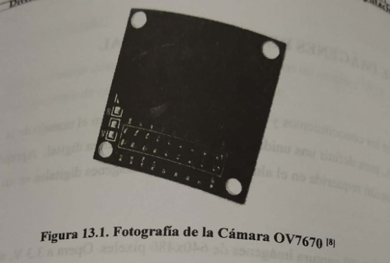
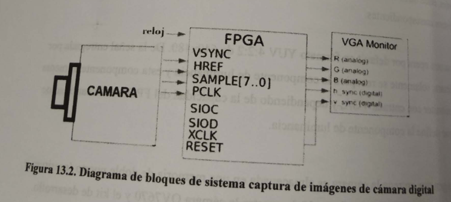
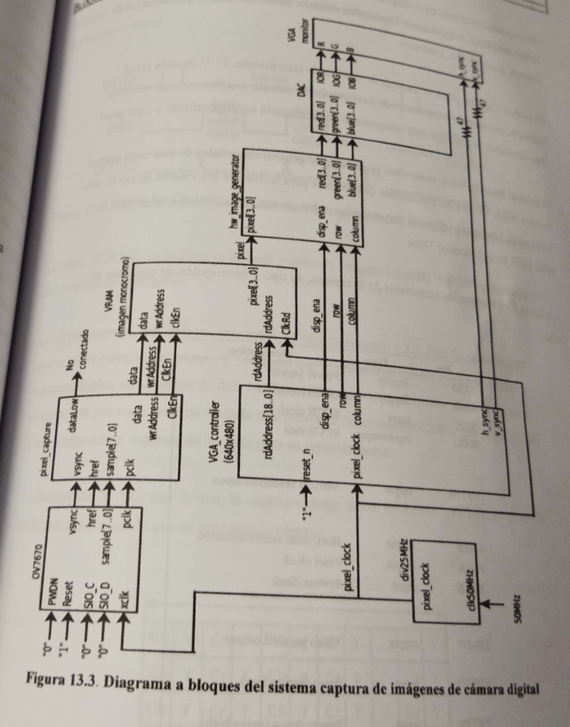
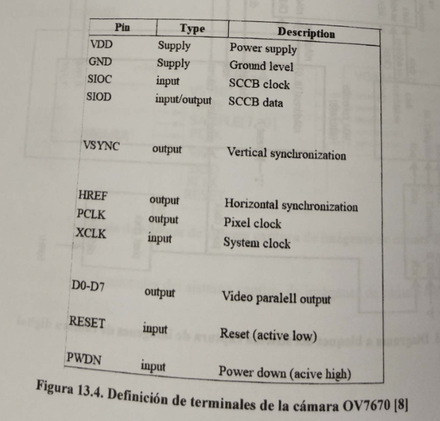
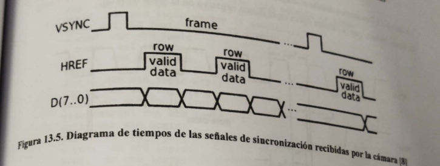
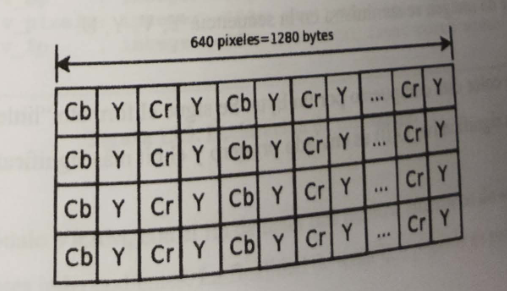
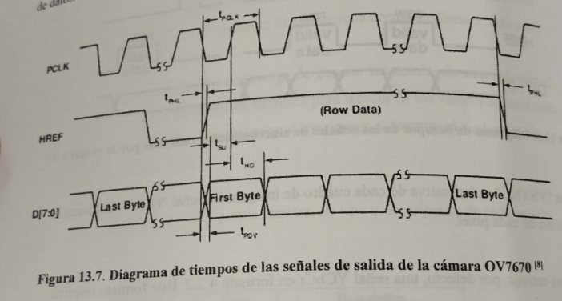
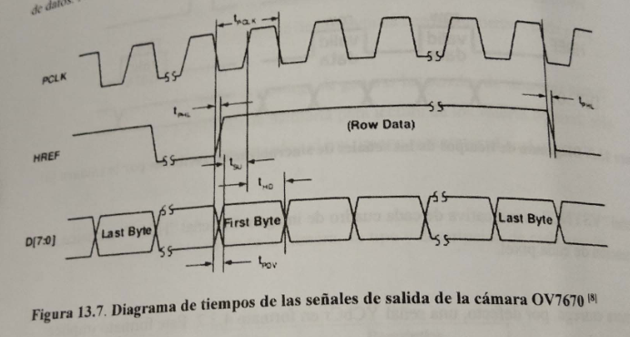
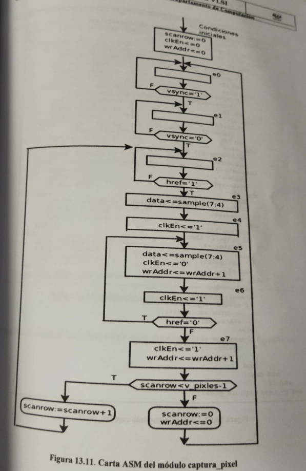

```
Practica: 13 Captura de imágenes de cámara digital
```

## Objetivos

El alumno aplicará los conocimientos y habilidades obtenidas en el manejo de la señalización VGA, para definirá una unidad de control de una cámara digital. Aprenderá además la señalización requerida en el almacenamiento de imágenes digitales de una FPGA.

# Introducción

La cámara digital 0V7670 captura de 649x480 pixeles. Opera a 3.3V aunque cuenta con un regulador que permite polarización de hasta 5V. El formato de salida de video, por defecto es el YUV (4:2:2), aunque puedas generar RGB 4:2:2 y RGB565/555/444. El protocolo de comunicación de la cámara es el SCCB, compatible con el protocolo de comunicación 12C (Inter Integrated Circuits). La cámara incluye un módulo para el control del color, de la saturación, del tinte, de gama y de realizado de bordes, entre otros. Éstos deben ser configurados escribiendo los valores adecuados en los registros correspondientes.

La cámara opera por default en formato YUV 4:2:2 de 640x480. De la señal entregadá por la cámara, solamente se recupera componente de iluminancia y esta componente alimenta a un monitor con entrada VGA, dependiendo de la capacidad del FPGA es la cantidad de bits que define la componente de luminancia.

La imagen que entrega la cámara es almacenada es una memoria de doble puerto (escritura y lectura) dentro de FPGA. La figura 13.1 muestra la cámara 0V7670 y el kit de desarrollo.



# Especificaciones

Utilizando una cámara digital, un FPGA y un monitor de entrada VGA, almacenar las imágenes dentro del FPGA con el fin de mostrarlas en un monitor. La figura 13.2 muestra el diagrama de bloques del sistema de captura de imagenes de cámara Digital.

# Diagrama de bloques



El diagrama a bloques  funcionales del sistema captura de imágenes de cámara digital es mostrado en la figura 13.3.

## Bloques funcionales



Como puede observarse en el diagrama se requiere diseñar cinco bloques funcionales dentro del FPGA. A cada uno los llamaremos módulo, siendo los más importantes los de los Captura_pixel y VGA_controller.

El módulo Captura_pixel, se encarga de caputrar la información YUV de cada pixel. Entonces se separa la componente de luminancia. Se calcula una dirección de memoria almacenar únicamente este componente de luminancia correspondiente a cada pixel.

El módulo llamado VGA_controller, se encarga de generar las señales de sincronía para el monitor VGA. Generar las direcciones de memoria para lectura de los valores de pixel: sólo señal RGB para el monitor VGA.

La figura 13.4 muestra las terminales de la cámara, su tipo y descripción de cada una de ellas.



La figura 13.5 muestra el diagrama de tiempos de las señales de sincronización recibidas por la cámara digital.



La señal "VSYNC" es indicativa de cada cuadro de imagen. La señal "HREF" enmarca la información de cada pixel.

La cámara entrega, por defecto, una señal YCbCr en formato 4.2.2. Este formato implica que se envía completo el plano "Y" en tanto que los planos de color Cb y Cr se envían submuestreados en un factor de dos. La figura 13.6 ilustra este formato. En esta figura  se observa que por cada pixel es enviada una pareja de componentes CbY ó una pareja CrY. Cada componente requiere de un byte para su representación.

La frecuencia de reloj con el cual, la cámara entrega datos, en formato YCbCr, es el doble de la frecuencia con la que se alimenta la cámara.



La figura 13.7 muestra a detalle el diagrama de tiempos con la cual la cámara envia bytes de datos. Nótese que la cámara opera en el flanco negativo de la señal de reloj.



Adicionalmente, se debe mencionar que la cámara debe alimentarse con una señal de reloj de 25Mhz, debido a que provee 30 cuadros por segundo.

Dado que no va enviar datos a la cámara, las señales de comunicación **SIOD** y **SIOC** pueden dejar abiertas o bien , en "1".

La cámara viene pre configurada para proveer una  salida  en formato YUV 4:4:2, en particular, cada línea de imagen se suminirstra en  la secuencia Y,V,Y,U.

Cada componente de color está compuesto por un byte. Se sigue el formato "litle endian", es decir, el bit menos significativo D(0) es enviado primero y el bit más significativo D(7) es enviado al final.

La figura 13.7 muestra detalle el diagrama de tiempos con la cual la cámara envía bytes de datos. Nótese que la cámara opera en el flanco negativo de la señal de reloj.



Adicionalmente, se debe mencionar que la cámara debe alimentarse con una señal de reloj de 25MHz, debido a que provee 30 cuadros por segundo.

Dado que no se va enviar datos a la cámara, las señales de comunicación **SIOD** y **SIOC** pueden dejarse abiertas o bien, en "1".

La cámara viene pre configurada para proveer una salida en formato  YUV 4:2:2, en particular, cada línea de imagen se suministra en la secuencia Y,V,Y,U.

Cada componente de color está compuesta por un byte. Se sigue el formato "little endian" es decir, el bit menos significativo D(0) es enviado primero y el bit más significativo D(7) es enviado al final.

La figura 13.8 la entidad del sistema Captura de imágenes de cámara digital en un FPGA.

```vhdl
port (clk50mhz : in std_logic;
	red : out std_logic_vector (3 downto 0);
	green : out std_logic_vector (3 downto 0);
	blue : out std_logic_vector (3 downto 0);
	n_sync : out std_logic;
	n_blank : out std_logic;
	n_sync : out std_logic;
	n_blank : out std_logic;
	h_sync : out std_logic;
	v_sync : out std_logic;
	sio_c : out std_logic:= '0';
	sio_d : out std_logic:= '0';
	pwdn : out std_logic:= '0';
	resetcamera : out std_logic:= '1';
	xclk : out std_logic;
	pclk : in std_logic;
	vsync : in std_logic;
	href : in std_logic;
	sample: in std_logic_vector(7 downto 0) 
	);
```

Las constantes usadas en el programa corresponden a la constantes que se requieren para manipular el monitor con entrada de puerto VGA. La figura 13.9 muestra la declaración de dichas constantes.

```vhdl
generic( -- contantes para monitor vga en 640x480
	constant h_pulse : integer:= 96; --horiztonal sync pulse with in pixels
	constant h_bp : integer :=48; -- horizontal back porch width in pixels
	constant h_pixels : integer:=640; -- horizontal display width in pixels 
	constant h_fp : integer :=16;  -- horizontal front  porch  widht in pixels
	constant v_pulse : integer :=2; -- vetical sync pulse width in rows
	constant v_bp : integer :=33; -- vertical sync pulse widht in pixels
	constant v_pixels : integer :=480; --vertical display widh in rows
	constant v_fp; --vertical front porch with in rows
);
```

Se diseñara un módulo VRAM, con el fin de tener dos puertos síncronos de acceso. Ambos puertos tienen relojes independientes. La finalidad de tener dos puertos es para evitar el diseño de una cola para las peticiones de acceso (lectura y escritura) un chip RAM. El código de la memoria es mostrado en la figura 13.10.

```vhdl
wrvram: process (clken) -- seccion de escritura
begin
	if rising_edge(clken) then
		memory(wraddr) <= data;
	end if;
end process wrvram;

rdvram : process (reloj_pixel) --sección de lectura
begin
	if falling_edge(reloj_pixel) then
		pixel<= memory(rdaddress);
	end if;
end process rdvram;
```

La razón  de esta memoria está en que la cámara maneja su propia señalizacion para enviar datos. Esta señalización es diferente de la que requiere el monitor VGA, por lo tanto, se requiere de un búfer que reciba datos de la cámara y que luego, pase los datos al monitor.

El búfer diseñado para este proyecto tiene doble puerto, cada uno con su propia señalización de reloj. Así, hay un puerto de escritura y hay un puerto de lectura.

La figura 13.11 muestra la carta ASM con la  información de la cámara y como se generan direcciones de memoria para almacenar los datos y la figura 13.12 muestra el código del módulo Captura_pixel.



```vhdl

```


```vhdl
captura_pixel: process (pclk)
	variable scanrow : integer range 0 to v_pixels:=0;
begin
	if rising_edge(pclk) then
		case state is
			when e0=>
				if vsync ='1' then
					state <=e1;
				end if;
			when e1 =>
				if vsync ='0' then
					state <=e2;
				end if;
			when e2 =>
				if href='1' then
					state <=e3;
				end if;
			when e3 =>
				data <=sample( 7 downto 4);
				state <=e4;
			when e4 =>
				clkEn<= '1';
				state <= e5;
			when e5 =>
				data <= sample (7 downto 4);
				clkEn <= '0'; wrAddr <= wrAddr +1;
				state <= e6;
			when e6 =>
				clkEn <= '1';
				if href ='1' then
					state <=e5;
				else
					state <=e7;
				end if;
			when e7 =>
				clkEn <= '0';
				wrAddr <= wrAddr +1;
				if scanrow < v_pixels-1 then
					scanrow := scanrow +1;
					state <=e2;
				else
					scanrow := 0;
					wrAddr <= 0;
					state <= e0;
				end if;
			end case;
		end if;
	end process captura_pixel;
```

Finalmente, la unión de todos los códigos antes mencionados se muestra en la figura 13,14.

[code]

[code]

[code]

[code]

[code]

## Actividades complementarias

El alumno investigará:

1. El funcionamiento de los sistemas de imágenes BAYER, FIVEON X3.
2. El modelo de color YUV.
3. Cuántos detectores de luz de color rojo, de color verde y de color azul hay en el ojo humano.
4. El alumno investigará el tamaño de imagen que captura la cámara de su teléfono celular.
5. El significado de binarización de imágenes.