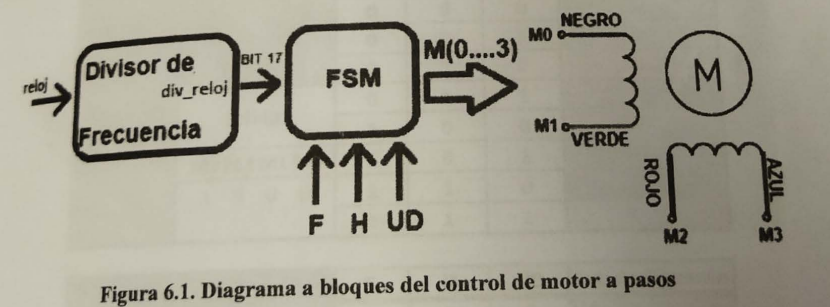
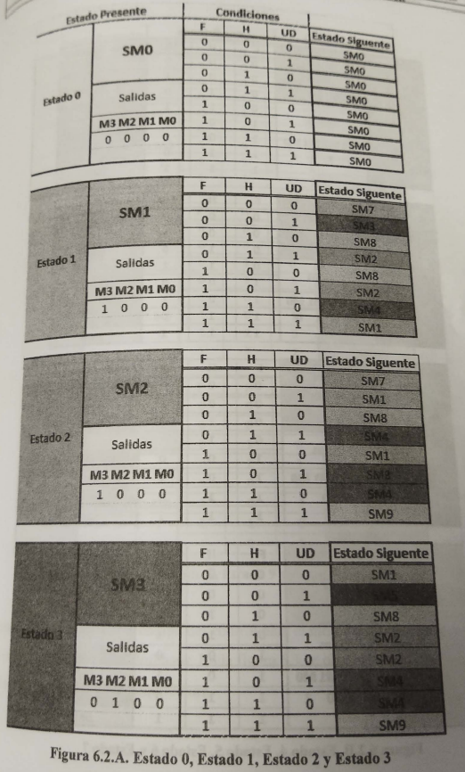
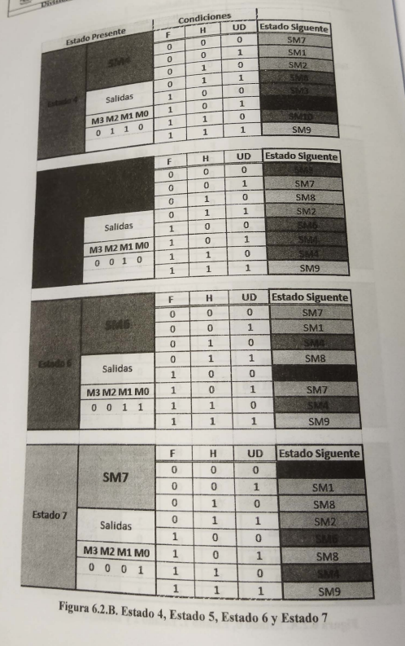
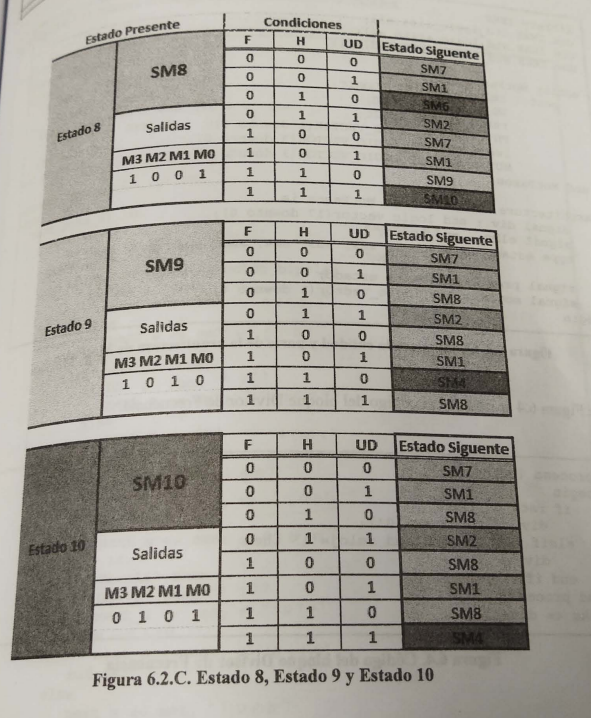

```
Practica 6
Diseño del control de motores a pasos
```

##  Objetivo

El alumno aprenderá  a diseñar el controlador de un motor a pasos mediante el uso e implantación de máquinas de estado.

## Especificaciones

Diseñar el circuito de control utilizando una FPGA, el cual se encargue de activar un motor a pasos bipolar con 4 líneas de control. Los movimientos que debe realizar el motor son en sentido a las manecillas de reloj, viceversa y detenido por medio de tres botones que controlan estos movimientos.

La figura 6.1 muestra el diagrama a bloques del sistema.

## Diagrama de bloques



## Tabla de estados

La figura 6.2, muestra la tabla de estados, la cual está diseñada con 11 estados  que inician en el  estado SM0 hasta el estado SM10. Por la cantidad  de condiciones de entrada y estados está expresada por colores para cada estado, para una mejor compresión. En la figura 6.2 A se observa el Estado 0, Estado 1, Estado 2 y Estado 3. En la figura 6.2 B se observa el Estado 4, Estado 5, Estado 6 y Estado 7. En la figura 6.2 C se observa el Estado 8, Estado 9 y Estado 10.







Las siguientes figuras muestran el código del control para el motor a pasos, el cual estará contenido en el archivo llamado MotPaos. En la figura 6.3 se observa el código de la entidad y las señales dentro de la arquitectura.

```vhdl
library IEEE;
use IEEE.std_logic_1164.all;
use IEEE.std_logic_arith.all;
use IEEE.std_logic_unsigned.all;

entity motPasos is
    port(
        reloj: in std_logic;
        ud : in std_logic;
    	rst: in std_logic;
    	fh : in std_logic_vector (1 downto 0);
    	led: out std_logic_vector (3 downto 0);
		mot: out std_logic_vector (3 downto 0)
		
)
end motPasos;

architectura beavioral of motPasos is
	signal div: std_logic_vector (17 downto 0);
	signal clks : std_logic;
	type estado is (sm0,sm1,sm2,sm3,sm4,sm5,sm6,sm7,sm8,sm9,sm10);
	signal pres_s,next_s : estado;
	signal motor : stad_logic_vector (3 downto 0);
begin
```

Figura 6.3 Código para la entidad y para de arquitecutra de MotPaos

En la Figura 6.4 se observa el código del bloque Divisor de Frecuencia.

```vhdl
process(reloj,rst)
begin
	if rst='0' then 
		div <= (others => '1');
    elsif reloj'event and reloj='1' then
        div <= div +1;
   end if;
	end process;
clks <= div(17);
```

Figura 6.4. Código del bloque Divisor de Frecuencia.

En la Figura 6.5 se observa el código de las transiciones de estados.


```vhdl
process (clks,rst)
begin
	if rst='0' then
		pres_s <= sm0;
	elsif clks'event and clk='1' then
		pres_s <= next_s;
	end if;
end process;

process (pres_s,ud,rst,fh)
begin
	case (pres_s) is
		when sm0 =>  --Estado 0
			next_s <= sm1;
		when sm1 =>  --Estado 1
			if fh="00" then --motor bipolar
				if ud='1' then
					next_s <= sm3;
				else
					next_s <= sm7;
				end if;
			elsif fh='01' then
				if ud='1' then
					next_s <= sm8;
				end if;
			elsif fh="10" then
				if ud='1' tehn
					next_s <= sm2;
				else
					next_s <= sm8;
				end if;
			elsif fh="11" then
				if ud='1' then
					next_s <= sm9;
				else
					next_s <= sm4;
				end if;
			else
				next_s <= sm1;
			end if;
		when sm2 =>  -- Estado 2
			if fh="00" then
				if ud='1' then
					next_s <= sm1;
				else
					next_s <= sm7;		
```

```vhdl
	elsif fh ="01" then
        	if ud='1' then
                next_s <= sm4;
        	else
                next_s <= sm8;
        	end if;
	elsif fh="10" then
		if ud='1' then
			next_s <= sm3;
		else
			next_s <= sm1;
		end if;
	elsif fh="11" then
		if ud='1' then
			next_s <= sm9;
		else
			next_s <= sm4;
		end if;
	else
		next_s <= sm2;
	end if;
when sm3=>
	if fh="00" then
		if ud='1' then
			next_s <= sm5;
		else
			next_s <= sm1;
		end if;
	elsif fh="01" then
		if ud ='1' then
			next_s <= sm2;
		else
			next_s <= sm8;
		end if;
	elsif fh="10" tehn
		if ud='1' then
			next_s <= sm4;
		else
			next_s <= sm2;
		end if;
	elsif fh = "11" then
		if ud='1' then
			next_s <= sm9;
		else
			next_s <= sm4;
		end if;
	else
		next_s <= sm3;
	end if;
```
Figura 6.5. (continuación) Transciones de estados

```vhdl
when am4 =>  --Estado 4
	if fh="00" then
		if ud='1' then
			next_a <= sm1;
		else
			next_s <= sm7;
		end if;
	elsif fh="01" then
		if ud='1' then
			next_s <= sm6;
		else
			next_s <= sm2;
		end if;
	elsif fh="10" then
		if ud='1' then
			next_s <= sm5;
		else
			next_s <= sm3;
		end if;
	elsif fh="11" then
		if ud='1' then
			next_s <= sm9;
		else
			next_s <= sm10;
		end if;
	else
		next_s <= sm4;
	end if;
when sm5 =>
	if fh="00" then
		if ud='1' then
			next_s <= sm7;
		else
			next_s <= sm3;
		end if;
	elsif fh="01" then
		if ud='1' then
			next_s <= sm2;
		else
			next_s <= sm8;
		end if;
	elsif fh="10" then
		if ud='1' then
			next_s <= sm6;
		else
			next_s <= sm4;
		end if;
	elsif fh="11" then
		if ud='1' then
			next_s <= sm9;
		else
			next_s <= sm4;
		end if;
```

Figura 6.5. (continuación) Tansiciones de estados

```vhdl
else
    next_s <= sm3;
end if;
when sm6 => -- Estado 6
    if fh="00" then
		if ud='1' then
			next_s <= sm1;
		else
			next_s <= sm7;
		end if;
	elsif fh="01" then
		if ud='1' then
			next_s <= sm8;
		else
			next_s <= sm4;
		end if;
	elsif fh ="10" then
		if  ud='1' then
			next_s <= sm7;
		else
			next_s <= sm5;
		end if;
	elsif fh="11" then
		if ud="1" then
			next_s <= sm9;
		else
			next_s <= sm4;
		end if;
	else
		next_s <= sm7;
	end if;
when sm7 =>   -- Estado 7
	if fh ="00" then
		if ud ='1' then
			next_s <= sm1;
		else
			next_s <= sm5;
		end if;
	elsif fh= "01" then
		if ud ='1' then
			next_s <= sm2;
		else
			next_s <= sm8;
		end if;
	elsif fh="10" then
		if ud='1' then
			next_s <= sm8;
		else
			next_s <= sm6;
		end if;
```

Figura 6.5. (continuación) Transiciones de estados

```vhdl
elsif fh="11" then
	if ud='1' then
		next_s <= sm9;
	else
		next_s <= sm4;
	end if;
else
	next_s <= sm7;
end if;
when sm8 =>
	if fh="00" then
		if ud='1' then
			next_s <= sm1;
		else
			next_s <= sm7;
		end if;
	elsif fh="01" then
		if ud='1' then
			next_s <= sm2;
		else
			next_s <= sm6;
		end if;
	elsif fh="10" then
		if ud='1' then
			next_s <= sm1;
		else
			next_s <= sm7;
		end if;
	elsif fh="11" then
		if ud='1' then
			next_s <= sm10;
		else
			next_s <= sm9;
		end if;
	else
		next_s <= sm8;
	end if;
when sm9 =>
	if fh="00" then
		if ud='1' then
			next_s <= sm1;
		else
			next_s <= sm7;
		end if;
	elsif fh="01" then
		if ud='1' then
			next_s <= sm2;
		else
			next_s <= sm8;
		end if;
	
```

Figura 6.5. (continuación) Transiciones de estados

```vhdl
elsif fh="10" then
    if ud='1' then
        next_s <= sm1;
	else
		next_s <= sm8;
	end if;
elsif fh="11" then
	if ud='1' then
		next_s <= sm8;
	else
		next_s <= sm4;
	end if;
else
	next_s <= sm9;
end if;
when sm10 =>  -- Estado 10
	if fh="00" then
		if ud='1' then
			next_s <= sm1;
		else
			next_s <= sm7;
		end if;
	elsif fh="01" then
		if ud='1' then
			next_s <= sm2;
		else
			next_s <= sm8;
		end if;
	elsif fh="10" then
		if ud='1' then
			next_s <= sm1;
		else
			next_s <= sm8;
		end if;
	elsif  fh="11" then
		if ud='1' then
			next_s<= sm4;
		else
			next_s <= sm8;
		end if;
	else
		next_s <= sm10;
	end if;
when others => next_s <= sm0;
end case;
end process;
			
```


Figura 6.5 (continuación) Transiciones de estados


```vhdl
process(press_s)
	begin
		case pres_s is
			when sm0 => motor <= "0000";
			when sm0 => motor <= "0000";
			when sm0 => motor <= "0000";
			when sm0 => motor <= "0000";
			when sm0 => motor <= "0000";
			when sm0 => motor <= "0000";
			when sm0 => motor <= "0000";
			when sm0 => motor <= "0000";
			when sm0 => motor <= "0000";
			when sm0 => motor <= "0000";
			when sm0 => motor <= "0000";
			when sm0 => motor <= "0000";
			when others => motor <= "0000";
		end case;
	end process;

MOT <= motor;
led <= motor;

end behavioral;
```

Figura 6.6 Salidas de estados


## Actividad complementaria:

El alumno deberá realizar las modificaciones permitentes para poder girar el motor las vueltas necesarias que representan los dígitos de su número de cuenta, se debe combinar los giros horarios, anti horario y detenido.
