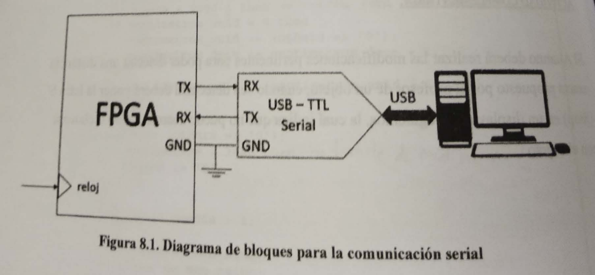
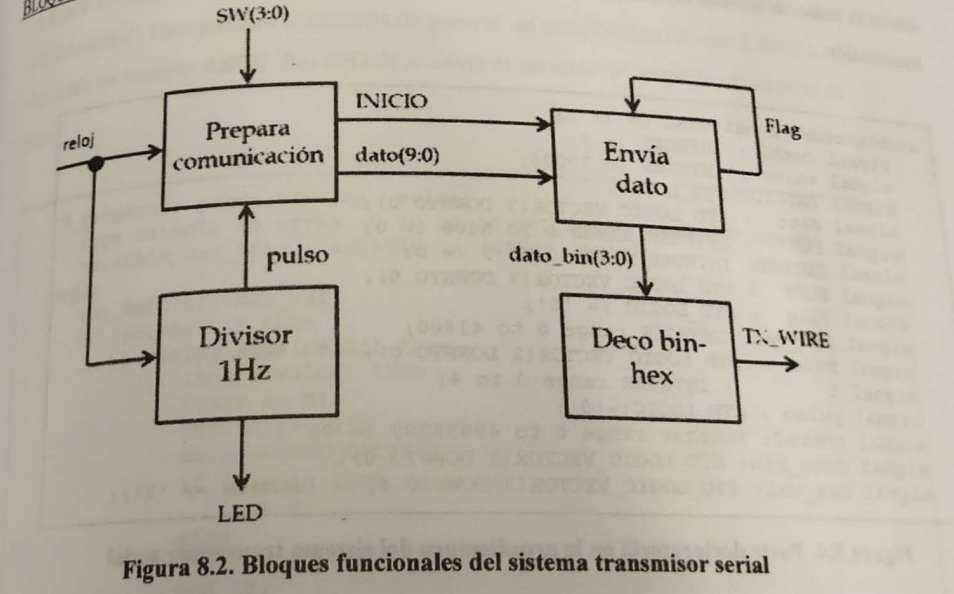

```
Práctica 8. Diseño de un transmisor para comunicación serial
```

## Objetivo

Demostrar a los estudiantes mediante el diseño de un módulo transmisor (TX), empleado en comunicaciones de tipo serial UART (Universal Asyncrhonous Reciver Tranmitter), la utilidad de este módulo, así como la importancia de su presencia en la arquitectura de un procesador para aplicaciones electrónicas en envío de información.

## Especificaciones

Utilizando un FPGA y un switch de 4 posiciones, diseñar un módulo Transmisor serial, el cual sea capaz de leer el valor binario del switch, procesarlo en el FPGA y posteriormente enviarlo a una computadora personal, en donde el dato deberá estar en formato hexadecimal. La conexión entre el FPGA y la computadora deberá realizarse empleando un circuito convertidor USB TTL-serial. La figura 8.1 muestra el diagrama de bloques del sistema.

## Diagrama de bloques



Un FPGA es un dispositivo lógico programable, el cual posee la característica de no contar con una arquitectura fija como en el caso de un procesador. Dicha característica trae consigo la posibilidad de diseñar arquitecturas reconfigurables en donde la cantidad de puertos o módulos periféricos puede ser establecida de acuerdo a las especificaciones de diseño. Así, el diseño de un módulo TX de comunicación UART puede ser elaborado y configurado para realizar tareas especificadas consumiendo el mínimo de recurso posible. La figura 8.2 muestra los bloques funcionales del sistema Transmisor, donde las señales se muestran como flechas de color azul, mientras que las terminales físicas se muestran de color rojo. Cada bloque funcional corresponde a un proceso que deberá ejecutarse dentro de la arquitectura.

## Bloques funcionales



La figura 8.3 muestra la parte entidad del sistema transmisor de comunicación serial. Las terminales físicas corresponden al reloj maestro del FPGA de 50 MHz, cuatro bits de un switch, un LED testigo y la línea de transmisión (TX_WIRE).

```vhdl
-- practica 8
LIBRARY IEEE;
USE IEEE.STD_LOGIC_1164.ALL;
USE IEEE.NUMERIC_std.STD.ALL;

ENTITY TX IS
	PORT (
		reloj : IN STD_LOGIC;
		sw : IN STD_LOGIC_VECTOR(3 DOWNTO 0);
		led : OUT STD_LOGIC;
		tx_wire : OUT STD_LOGIC
	);
END ENTITY;
```

La figura 8.4 muestra la parte declaratoria de la arquitectura del módulo **TX**. En donde se declaran todas las señales involucradas en los diferentes procesos del sistema de transmisión.

```vhdl
---------
ARCHITECTURE behaivoral OF TX IS
	SIGNAL conta : INTEGER := 0;
	SIGNAL valor : INTEGER := 70000;
	SIGNAL inicio : STD_LOGIC;
	SIGNAL dato : STD_LOGIC_VECTOR(7 DOWNTO 0);
	SIGNAL pre : INTEGER RANGE 0 TO 5208 := 0;
	SIGNAL indice : INTEGER RANGE 0 TO 9 := 0;
	SIGNAL buff : STD_LOGIC_VECTOR (9 DOWNTO 0);
	SIGNAL flag : STD_LOGIC := '0';
	SIGNAL pre_val : INTEGER RANGE 0 TO 41600;
	SIGNAL baud : STD_LOGIC_VECTOR (2 DOWNTO 0);
	SIGNAL i : INTEGER RANGE 0 TO 4;
	SIGNAL pulso : STD_LOGIC := '0';
	SIGNAL contador : INTEGER RANGE 0 TO 49999999 := 0;
	SIGNAL dato_bin : STD_LOGIC_VECTOR (3 DOWNTO 0);
	SIGNAL hex_val : STD_LOGIC_VECTOR (7 DOWNTO 0) := (OTHERS => '0');
```

La figura 8.5 muestra el proceso "TX_divisor" asociado al bloque funcional "Divisor 1Hz". Éste se encarga de generar una señal denominada "pulso", la cual indica al siguiente proceso cuando es que debe preparar el dato que será transmitido. La configuración mostrada envía un dato cada segundo.

```vhdl
--------
BEGIN
	TX_divisor : PROCESS (reloj)
	BEGIN
		IF rising_edge(reloj) THEN
			contador <= contador + 1;
			IF (contador < 140000) THEN
				pulso <= '1';
			ELSE
				pulso <= '0';
			END IF;
		END IF;
	END PROCESS TX_divisor;
```

La figura 8.6 muestra el proceso "Tx_preparada", en él se implementa al bloque "Preara comunicación ". Este proceso se encarga de generar un arreglo que contiene 2 datos a transmitir en formato ASCII. Por default se envía al carácter '0', seguido de un salto de línea.

```vhdl
---------
	TX_prepara : PROCESS (reloj, pulso)
		TYPE arreglo IS ARRAY (0 TO 1) OF STD_LOGIC_VECTOR(7 DOWNTO 0);
		VARIABLE asc_dato : arreglo := (X"30", X"0A");
	BEGIN
		asc_dato(0) := hex_val;
		IF (pulso = '1') THEN
			IF rising_edge(reloj) THEN
				IF (conta = valor) THEN
					conta <= 0;
					INICIO <= '1';
					dato <= asc_dato(i);
					IF (i = 1) THEN
						i <= 0;
					ELSE
						i <= i + 1;
					END IF;
				ELSE
					conta <= conta + 1;
					inicio <= '0';
				END IF;
			END IF;
		END IF;
	END PROCESS TX_prepara;
```

La figura 8.7 presenta el código del proceso "TX_envia", correspondiente a la descripción del bloque funcional "Envía dato". Dicho proceso es el encargado de generar la velocidad de transmisión "Baudrate" y colocar los datos previamente preparados para ser enviados a través de la línea de transmisión.

```vhdl
---------
	TX_envia : PROCESS (reloj, inicio, dato)
	BEGIN
		IF (reloj'EVENT AND reloj = '1') THEN
			IF (flag = '0' AND inicio = '1') THEN
				flag <= '1';
				buff(0) <= '0';
				buff(9) <= '1';
				buff(8 DOWNTO 1) <= dato;
			END IF;
			IF (flag = '1') THEN
				IF (pre < pre_val) THEN
					pre <= pre + 1;
				ELSE
					pre <= 0;
				END IF;
				IF (pre = pre_val/2) THEN
					tx_wire <= buff(indice);
					IF (indice < 9) THEN
						indice <= indice + 1;
					ELSE
						flag <= '0';
						indice <= 0;
					END IF;
				END IF;
			END IF;
		END IF;
	END PROCESS TX_envia;
```

Finalmente, la figura 8.8 muestra la última parte de la arquitectura del sistema transmisor serial, en donde se realiza la lectura y decodificación del valor binario leído en el switch, para su correspondiente transformación al código ASCII que será transmitido. Así mismo, se presenta la selección de la velocidad de transmisión mediante la señal "baud" dentro de una lista sensible.

```vhdl
---------
	led <= pulso;
	dato_bin <= sw;
	baud <= "011";

	WITH(dato_bin) SELECT
	hex_val <= X"30" WHEN "0000",
		X"31" WHEN "0001",
		X"32" WHEN "0010",
		X"33" WHEN "0011",
		X"34" WHEN "0100",
		X"35" WHEN "0101",
		X"36" WHEN "0110",
		X"37" WHEN "0111",
		X"38" WHEN "1000",
		X"39" WHEN "1001",
		X"41" WHEN "1010",
		X"42" WHEN "1011",
		X"43" WHEN "1100",
		X"44" WHEN "1101",
		X"45" WHEN "1110",
		X"46" WHEN "1111",
		X"23" WHEN OTHERS;

	WITH (baud) SELECT
	pre_val <= 41600 WHEN "000", -- 1200 bauds
		20800 WHEN "001", -- 2400 bauds
		10400 WHEN "010", -- 9600 bauds
		5200 WHEN "011", -- 19200 bauds
		2600 WHEN "100", -- 38400 bauds
		1300 WHEN "101", -- 38400 bauds
		866 WHEN "110", -- 57600 bauds
		432 WHEN OTHERS; --115200 bauds
END ARCHITECTURE behaivoral;
```


## Actividad complementaria

El alumno diseñará un sistema capaz de enviar el valor del switch en forma binaria, es decir cuatro caracteres, un por bit leído. La forma en que la secuencia de texto que deberá ser visualizado en la computadora es : **Valor binario=XXXX**, en donde XXXX representa el número de 4 bits. 