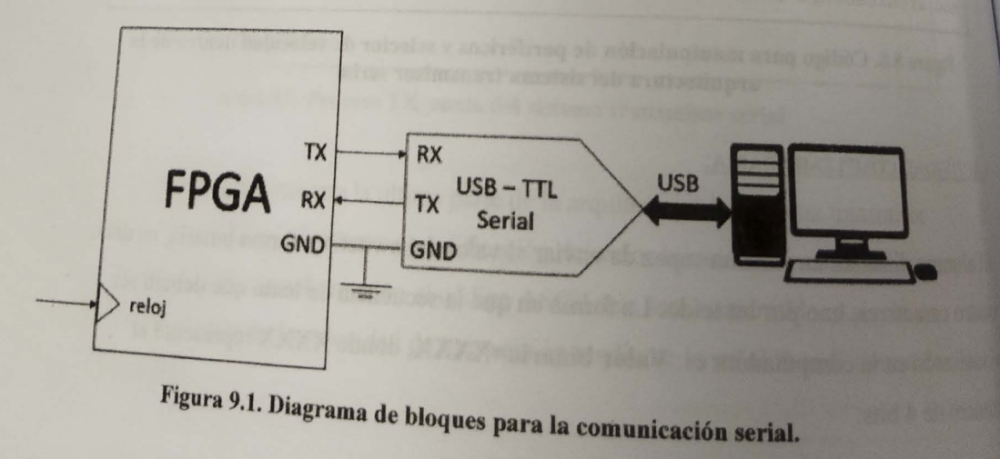

```
Práctica 9. Diseño de un receptor para comunicación serial
```

## Objetivo

Demostrar a los estudiantes mediante el diseño de un módulo receptor (RX), usando en comunicaciones de tipo seria UART (Universal Asyncrhonous Receiver Transmitter), la utilidad de este módulo, así  como la importancia de su presencia en la arquitectura de un procesador  para aplicaciones electrónicas de recepción de información. Mostrar su aplicación en el control de dispositivos periféricos desde una  terminal remota.

## Especificaciones

Utilizando un FPGA y 8 LEDS, diseñar un sistema receptor serial, el cual sea capaz de recibir un carácter ASCII del teclado de una computadora, procesarlo en el FPGA y posteriormente mostrar su código binario en los 8 LEDS. La conexión entre el FPGA y la computadora deberá realizarse empleando un circuito convertidos USB TTL-Serial. La figura 9.1 muestra el diagrama de bloques del sistema.

## Diagrama de bloques



Al igual que el sistema tranmisor, su contraparte receptora resulta útil de ser implementada en un dispositivo FPGA, dadas las características de reconfiguración de éste. Aunado a ello y a la capacidad e emplear recursos de hardware mínimos, un módulo RX  en la comunicación UART permite a su vez una amplia gama de aplicaciones electrónicas y de computo.

Es importante resaltar que en este punto, será posible observar que la implementación de este sistema será más simple que en el caso del transmisor, en donde gran parte de la lógica que estable la velocidad transmisión es idéntica.

La figura 9.2 muestra los bloques funcionales del  Sistema Receptor, donde las señales se muestran como flechas de color azul, mientras que las terminales físicas se muestran en color rojo.

## Bloques funcionales


La figura 9.3 muestra la parte entidad del sistema receptor de comunicación serial. Las terminales físicas corresponden al reloj maestro del FPGA de 50 MHz, 8 LEDS y la línea de recepción (`RX_WIRE`).

```vhdl
library ieee;
use ieee.std_logic_1164.all;        -- for addition & counting
use ieee.numeric_std.all;               -- for type conversions

entity RX is
	port (
		reloj : in std_logic;
		leds: out std_logic_vector(7 downto 0);
		rx_wire : in std_logic
	);
end RX;
```

La figura 9.4 muestra la parte declaratoria de la arquitectura del módulo **RX**, en donde se declaran todas las señales involucradas en el proceso de recepción del dato providente de la computadora.

```vhdl
------
architecture behaivoral of RX is
	signal buff : std_logic_vector(9 downto 0);
	signal flag : std_logic :='0';
	signal pre: integer range 0 to 5208 :=0;
	signal indice : integer range 0 to 9 := 0;
	signal pre_val : integer range 0 to 41600;
	signal baud : std_logic_vector(2 downto 0);

```

La figura 9.5 presenta el código del proceso "RX_dato", correspondiente a la descripción del bloque funcional "Recibir dato". Dicho proceso es el encargado de generar la velocidad de transmisión "Baudrate" y recibir los bits asociados al dato proveniente de la terminal física `RX_WIRE`, para posteriormente ser transferido a los 8 LEDS.

```vhdl
------
begin
	RX_dato : process(reloj)
	begin
		if (reloj'event and reloj ='1') then
			if (flag='0' and rx_wire='0') then
				flag<='1';
				indice<=0;
				pre<=0;
			end if;
			if (flag='1') then
				buff(indice)<=rx_wire;
				if(pre < prev_val) then
					pre <=pre+1;
				else
					pre<=0;
				end if;
				if (pre= pre_val/2) then
					if (indice <9 ) then
						indice <= indice +1;
					else
						if (buff(0)='0' and buff(9)='1') then
							leds<= buff(8 downto 1);
						else
							leds <= "00000000";
						end if;
						flag <= '0';
					end if;
				end if;
			end if;
		end if;
	end process RX_dato;
```

Finalmente, la figura 9.6 muestra la última parte de la arquitectura del sistema receptor serila, en donde se selecciona la velocidad de recepción.

```vhdl
------
baud<= "011";
with (baud) select
	pre_val <= 	41600 when "000", --1200 bauds
		20800 when "001", --2400 bauds
		10400 when "010", --4800 bauds
		5200 when "011", --9600 bauds
		2600 when "100", --19200 bauds
		1300 when "101", --38400 bauds
		866 when "110", --57600 bauds
		432 when others; --115200 bauds

end architecture behaivoral;
```


## Actividad complementaria

El alumno diseñará un sistema capaz de realizar el control de acciones sobre periféricos conectados al FPGA. El control deberá realizarse seleccionado cuatro diferentes caracteres del teclado de la computador para ejecutar las siguientes tareas:

1 ) Corrimiento de LEDS

2 ) Leer el estado del dipswitch y mostrarlo en 4 leds

3 ) Contador binario de 0 a 9

4 ) PWM en un LED


# Desarrollo solución (original)

