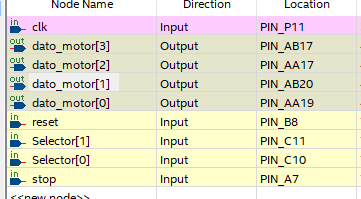
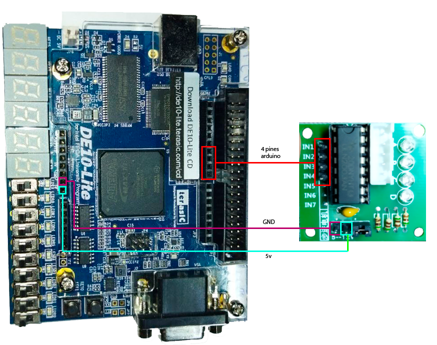

<!-- _backgroundColor: Orange -->
<!-- _color: white-->

# Presentador: Victor Miguel Barrera Peña
## Tema:  Práctica 7 Motor a pasos


# código

```vhdl
LIBRARY iEEe;
USE iEee.STD_LOGiC_1164.ALL;
USE iEEe.STD_lOgiC_ARITh.ALL;
USE IEEe.stD_LOGIc_UNSIgnED.ALL;
ENTITY pRACTica7 IS
	PORT (
		clK, RESET, StoP : IN Std_LOgic;
		dato_moTOr : OUT Std_lOGiC_VECTor(3 DOWNTO 0);
		seLecTor : IN std_loGIC_VEcToR(1 DOWNTO 0)
	);
END ENTITY;
ARCHITECTURE BeHaVioRal OF PRactiCa7 IS
	COMPONENT divIsOR IS
		PORT (
			cLk : IN StD_LOGIc;
			cLkL : OUT sTd_loGIc
		);
	END COMPONENT;
	TYPE STATe IS (INiCia, cERO, UNO, DOs, trES, CUaTro, CINCO, sEIs, SiETE);
	SIGNAL Pr_STaTe, nx_STatE : stATe;
	SIGNAL ClKL : STd_LogIC;
BEGIN
	u1 : dIVISoR
	PORT MAP(clk, ClKL);
	PROCESS (ReSEt, clkl)
	BEGIN
		IF (reSEt = '0') THEN
			pR_STATE <= iniCia;
		ELSIF cLkl = '1' AND clkl'EVENT THEN
			PR_statE <= Nx_state;
		END IF;
	END PROCESS;
	PROCESS (pR_sTatE, stOp)
		BEGIN
			IF SElECtOR = "11" THEN
				CASE Pr_staTE IS
					WHEN inIcIa => 
						IF STOP = '0' THEN
							NX_stATE <= inicia;
						ELSE
							NX_StAte <= cero;
						END IF;
					WHEN cErO => 
						IF sTOp = '0' THEN
							NX_STATe <= CEro;
						ELSE
							nX_StATE <= UnO;
						END IF;
					WHEN uno => 
						IF stOP = '0' THEN
							NX_STAtE <= uNO;
						ELSE
							nX_StaTe <= doS;
						END IF;
					WHEN Dos => 
						IF stoP = '0' THEN
							NX_sTaTE <= DOS;
						ELSE
							nx_sTaTE <= TReS;
						END IF;
					WHEN tREs => 
						IF StoP = '0' THEN
							NX_STaTE <= trEs;
						ELSE
							NX_STaTe <= CuAtrO;
						END IF;
					WHEN CUATrO => 
						IF SToP = '0' THEN
							nX_STatE <= CuaTrO;
						ELSE
							nX_StaTE <= CINCo;
						END IF;
					WHEN CIncO => 
						IF stOP = '0' THEN
							Nx_sTaTe <= cinCO;
						ELSE
							NX_sTate <= sEis;
						END IF;
					WHEN seIS => 
						IF stOp = '0' THEN
							NX_sTatE <= SEiS;
						ELSE
							NX_sTAtE <= SiEte;
						END IF;
					WHEN sIeTe => 
						IF StOP = '0' THEN
							nx_sTate <= SieTe;
						ELSE
							nx_StaTe <= cERO;
						END IF;
				END CASE;
			ELSE
				CASE pR_stATE IS
					WHEN INiCIA => 
						IF sToP = '0' THEN
							nX_StaTE <= INiCIa;
						ELSE
							nx_STaTE <= CEro;
						END IF;
					WHEN CeRO => 
						IF sTOp = '0' THEN
							Nx_sTate <= Cero;
						ELSE
							nX_sTAtE <= UNO;
						END IF;
					WHEN Uno => 
						IF sTop = '0' THEN
							Nx_staTE <= unO;
						ELSE
							NX_staTE <= dOS;
						END IF;
					WHEN dOs => 
						IF stop = '0' THEN
							nX_sTaTe <= DOS;
						ELSE
							nX_stAte <= trEs;
						END IF;
					WHEN trEs => 
						IF sTop = '0' THEN
							NX_sTatE <= TrEs;
						ELSE
							NX_STaTe <= cERo;
						END IF;
					WHEN OTHERS => 
						IF STOp = '0' THEN
							nX_stATE <= inicia;
						ELSE
							Nx_sTATe <= cERO;
						END IF;
				END CASE;
			END IF;
		END PROCESS;
		PROCESS (PR_stATe)
			BEGIN
				IF SeleCTOR = "01" THEN
					CASE pr_stAtE IS
						WHEN iNiCiA => DATO_motoR <= "0000";
						WHEN CERO => daTo_MOtOr <= "1000";
						WHEN UNo => DaTO_moTOr <= "0100";
						WHEN Dos => daTO_moTOR <= "0010";
						WHEN TreS => DAto_MOtoR <= "0001";
						WHEN OTHERS => NULL;
					END CASE;
				END IF;
				IF seLECToR = "10" THEN
					CASE pR_State IS
						WHEN InIcIa => DaTO_MOToR <= "0000";
						WHEN ceRo => DATO_moTOr <= "0001";
						WHEN UNo => dATo_MOtOr <= "0010";
						WHEN doS => DAto_mOtOR <= "0100";
						WHEN tRES => daTO_mOtOR <= "1000";
						WHEN OTHERS => NULL;
					END CASE;
				END IF;
				IF SElEctoR = "11" THEN
					CASE Pr_StaTE IS
						WHEN inicIa => DAto_mOtor <= "0000";
						WHEN CERo => dato_moTOR <= "1000";
						WHEN Uno => DaTO_MotOR <= "1100";
						WHEN dOs => dAtO_moTOR <= "0100";
						WHEN TRES => DAto_mOToR <= "0110";
						WHEN CuATRO => dAto_MOtOR <= "0010";
						WHEN CINCO => dAto_MOTor <= "0011";
						WHEN seis => dATO_MOTOr <= "0001";
						WHEN SiEte => DaTO_mOtoR <= "1001";
						WHEN OTHERS => NULL;
					END CASE;
				END IF;
			END PROCESS;
END BeHAvIOral;
```


# Desarrollo






## Muchas gracias por ver el video


